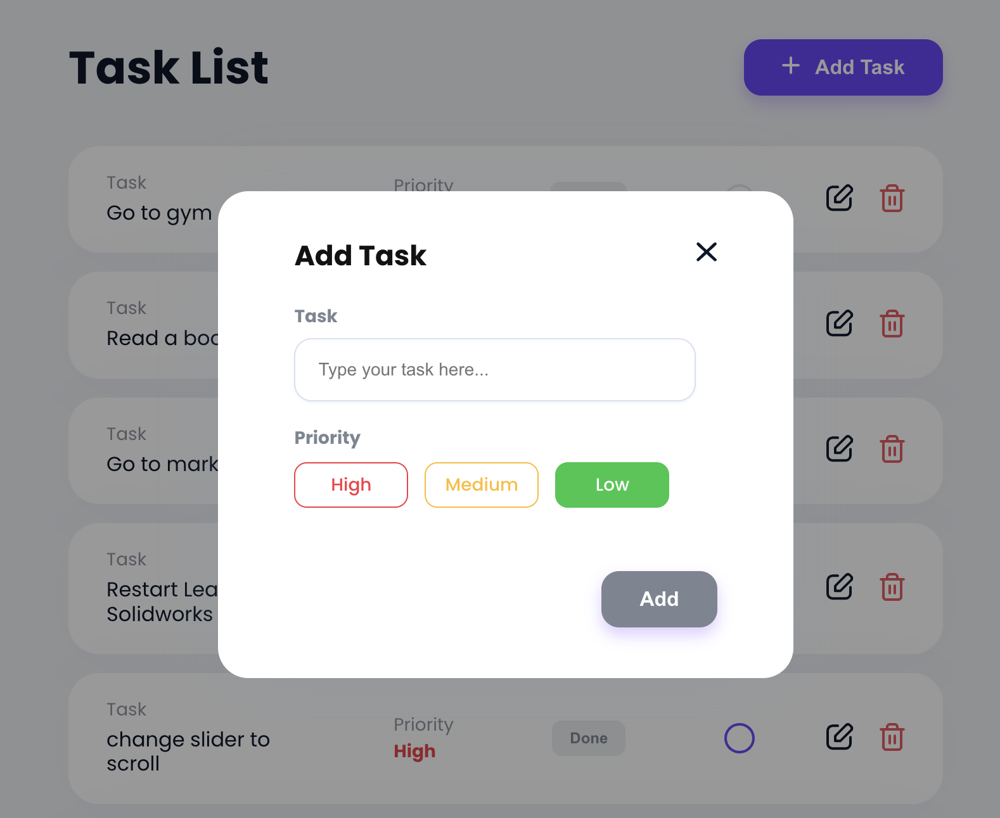
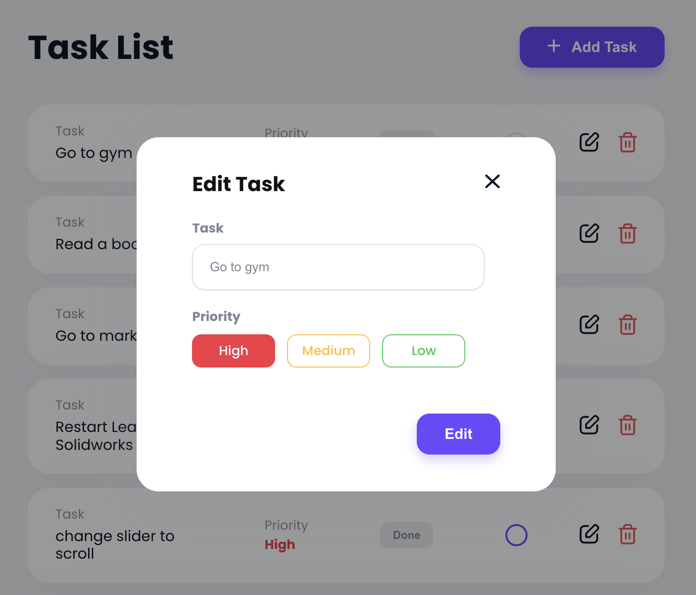
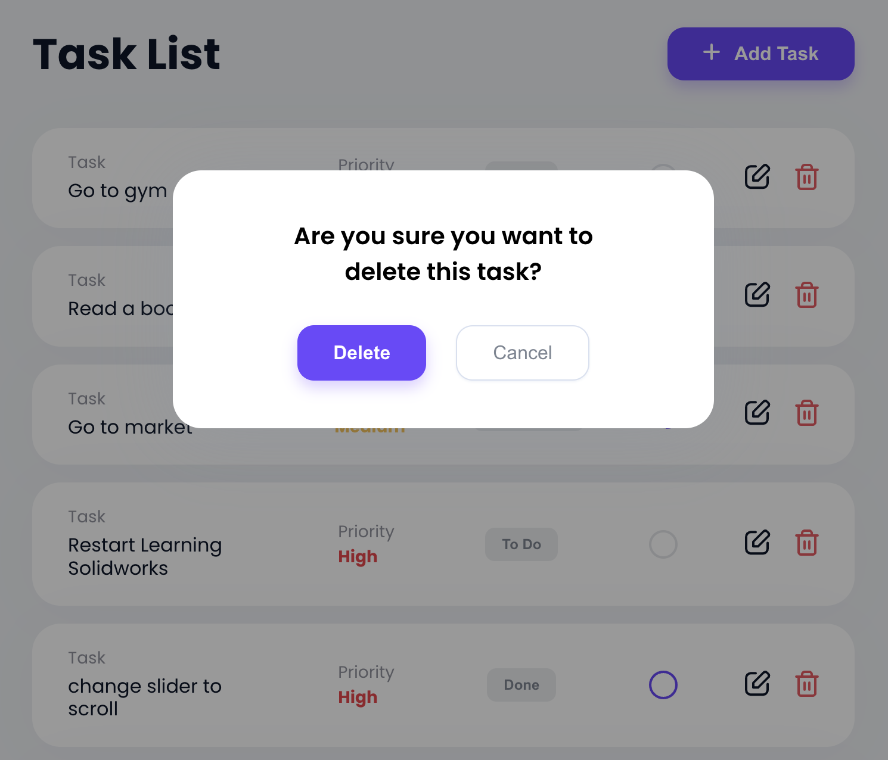

# Challenge:

Make this UI along with functional APIs. You are free to choose the library to make API calls.


### Getting started

```shell
# to start vite and load UI
npm run dev
```

```shell
# to start dev server
npm run devServer
```

### Questions

- Create a modular reusable UI to fetch top 10 tasks.
- Features:
  - Clicking on "progress" button should update task to the next step.
    - To Do -> In Progress -> Done -> To Do ...
  - Add Task should add the task to server 
- Bonus
  - Filter by user
  - Edit & Delete  
- Resources already added:
  - Icons
  - Css Variables for colors, shadow
  - API server

### Routes

```
GET    /users
GET    /tasks
POST   /tasks
PUT    /tasks/1
DELETE /tasks/1
```

### Filter

Use `.` to access deep properties

```
GET /tasks?userId=4
GET /tasks?id=1&id=2
GET /users?company.name=Robel-Corkery
```

### Paginate

Use `_page` and optionally `_limit` to paginate returned data.

In the `Link` header you'll get `first`, `prev`, `next` and `last` links.

```
GET /posts?_page=7
GET /posts?_page=7&_limit=20
```

### Sort

Add `_sort` and `_order` (ascending order by default)

```
GET /posts?_sort=views&_order=asc
GET /posts/1/comments?_sort=votes&_order=asc
```

For multiple fields, use the following format:

```
GET /posts?_sort=user,views&_order=desc,asc
```
